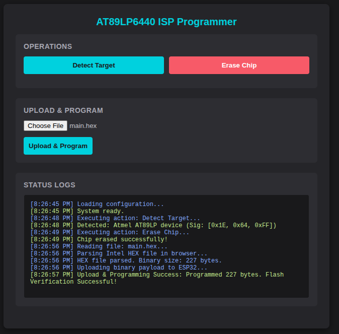

# ESP32 AT89LP6440 ISP Programmer

An open-source In-System Programmer (ISP) for the Microchip/Atmel **AT89LP6440** (and other AT89LP family microcontrollers), built using ESP-IDF. The system operates as a SoftAP Wi-Fi hotspot and provides a premium web interface for wireless chip identification, erasing, and HEX programming.

## Hardware Connections

Since the AT89LP6440 operates natively at **2.4V to 3.6V**, it can be powered directly from the ESP32's **3.3V** rail, eliminating the need for logic-level shifters.

| AT89LP6440 Target Pin | Function | ESP32 GPIO Pin (Example) |
|---|---|---|
| P1.7 (SCK) | Serial Clock | GPIO 18 |
| P1.6 (MISO) | Serial Data Out (to ESP32) | GPIO 19 |
| P1.5 (MOSI) | Serial Data In (from ESP32) | GPIO 23 |
| P1.4 ($\overline{\text{SS}}$) | Slave Select (Active Low) | GPIO 5 |
| $\overline{\text{RST}}$ | Reset (Active Low Entry) | GPIO 4 |
| GND / VDD | Common Ground / Power (3.3V) | GND / 3.3V |

> [!NOTE]
> If your target board has other circuitry connected to these SPI pins, place serial resistors (~1kΩ) on the SCK, MISO, MOSI, and SS lines to prevent driver contention during programming.

## Programming Parameters (AT89LP6440)
* **Code Flash Size**: 64 KB (65,536 bytes)
* **Code Page Size**: 64 bytes
* **Total Pages**: 1024 pages
* **Data Flash Size**: 8 KB (8,192 bytes)
* **Data Page Size**: 128 bytes
* **Preamble**: 2 bytes (`0xAA`, `0x55`)
* **SPI Mode**: Mode 0 (CPOL = 0, CPHA = 0), MSB first, maximum SCK frequency 1 MHz.

## Web Interface Features
* **Detect Chip**: Sends the `Programming Enable` command sequence and reads the 3-byte signature row to identify the target chip.
* **Chip Erase**: Performs a full chip erase (erasing both code and data memory arrays, leaving lock bits unlocked).
* **Upload HEX**: Uploads an Intel HEX file, parses it, programs the target code pages (using Page Write with Auto-Erase, opcode `0x70`), and verifies the write.

## Software Architecture (ESP-IDF)
* **SoftAP Configuration**: Sets up an open access point (e.g., `ESP32-AT89LP-ISP`).
* **HTTP Web Server**: Serves a single-page app (HTML/CSS/JS) with interactive controls.
* **REST API Endpoints**:
  * `GET /api/detect`: Executes chip identification.
  * `POST /api/erase`: Performs a full erase.
  * `POST /api/program`: Accepts the HEX payload, programs pages, and returns progress/validation status.
* **SPI Driver**: Mode 0 master interface with dedicated GPIO control for target hardware reset entry sequences.
