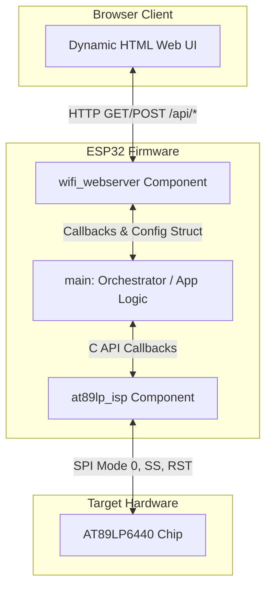

# Firmware Architecture & Design Specification

This document details the modular, event-driven firmware architecture implemented in the ESP32 AT89LP6440 ISP Programmer.

---

## 1. High-Level Architecture Overview

The system is strictly decoupled into three layers to ensure separation of concerns, memory efficiency, and reusable modules:



---

## 2. Component Breakdown

### A. Main Orchestrator (`main`)
* **Source**: [esp-isp-at89lp.c](file:///home/raees/works/my-works/esp-isp-at89lp/main/esp-isp-at89lp.c)
* **Role**: Orchestrates the system setup and links events from the network side (`wifi_webserver`) to the target programming side (`at89lp_isp`).
* **Responsibilities**:
  * Configures the layout of the web page (defines buttons, title, upload capability).
  * Implements action callbacks (e.g., executing target detection or erasing the chip).
  * Directs programming flow (allocating heap memory, writing pages block-by-block, and verifying memory).

### B. ISP Hardware Driver (`at89lp_isp`)
* **Source**: [at89lp_isp.c](file:///home/raees/works/my-works/esp-isp-at89lp/components/at89lp_isp/at89lp_isp.c)
* **Role**: Low-level SPI master driver for Atmel/Microchip AT89LP microcontrollers.
* **Responsibilities**:
  * Manages target reset ($\overline{\text{RST}}$) and chip-select ($\overline{\text{SS}}$) state machines.
  * Sends standard ISP preambles (`0xAA 0x55`) and command opcodes (Enable, Read Signature, Page Write, Chip Erase).
  * Implements timing constraints and polls the target status register ($\overline{\text{BUSY}}$ flag).

### C. Reusable Web Server Component (`wifi_webserver`)
* **Source**: [wifi_webserver.c](file:///home/raees/works/my-works/esp-isp-at89lp/components/wifi_webserver/wifi_webserver.c)
* **Role**: A completely decoupled, configuration-driven WiFi Access Point and HTTP server.
* **Why it is Reusable**:
  This component contains **no application-specific logic**. It does not know about SPI, ISP, or the AT89LP6440. It renders the user interface dynamically based on a configuration struct provided at startup and relays actions to `main` via callbacks.

---

## 3. Deep-Dive: The Reusable `wifi_webserver` Component

### Configuration Interface
To deploy this component in another project, you simply configure the AP settings, labels, and button actions using `wifi_webserver_config_t`:

```c
typedef struct {
    const char *title;            // Web Page Header Title
    const char *ssid;             // SoftAP WiFi SSID name
    const char *password;         // WiFi password (empty string = Open Network)
    bool upload_enabled;          // Toggle file upload container visibility
    const char *upload_accept;    // HTML input file filter (e.g. ".bin", ".hex")
    
    wifi_webserver_button_t buttons[8]; // Custom button controls
    int button_count;
} wifi_webserver_config_t;
```

### Event Routing via Callbacks
When the user interacts with the Web UI in their browser, events are routed to your application via the registered callbacks:

```c
typedef struct {
    // Triggers when a web UI button is clicked
    esp_err_t (*on_button_action)(const char *action_id, char *out_msg, size_t max_msg_len);
    
    // Triggers when a file is uploaded
    esp_err_t (*on_file_upload)(const char *filename, const char *file_data, size_t file_len, char *out_msg, size_t max_msg_len);
} wifi_webserver_callbacks_t;
```

### Dynamic Web UI Generation
1. On page load, the browser queries `GET /api/config`.
2. The `wifi_webserver` component formats the C configuration struct into a JSON payload and returns it to the client.
3. The JavaScript in the browser dynamically modifies the HTML document object model (DOM):
   * Sets the header title text.
   * Generates buttons matching the IDs and styling configured.
   * Renders the file selector panel only if `upload_enabled` is true.

---

## 4. Memory-Efficient Binary Upload Flow

Rather than parsing ASCII text files on the ESP32, which would require significant heap memory, we parse in the browser:

```
[Intel HEX File (180 KB)]
        │
        ▼ (JavaScript in Browser)
   [Parse lines & checksums]
        │
        ▼ (Binary Payload)
   [Raw Byte Array (max 64 KB)]
        │
        ▼ (HTTP POST)
   [ESP32 Web Server (wifi_webserver)]
        │
        ▼ (Callback)
   [Flash Target (main -> at89lp_isp)]
```

* **Client Parsing**: The browser parses the text HEX file into raw binary data.
* **Network Upload**: The browser sends a binary body (`application/octet-stream`) directly to `/api/upload`.
* **Low Heap Footprint**: The ESP32 Web Server receives the binary data in chunks, storing it directly into the allocation buffer. The maximum heap space required on the ESP32 is strictly limited to 64 KB, protecting the microcontroller from memory exhaustion.
